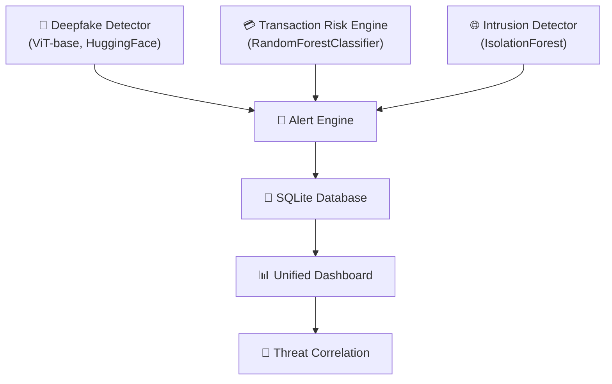

# 🛡️ CyberGuard AI — Unified Fraud, Deepfake & Intrusion Detection Platform

**CyberGuard AI** is a unified cybersecurity platform that detects deepfake impersonation, UPI transaction fraud, and network intrusions through a single pane of glass. By correlating alerts across three independent AI detection modules, CyberGuard AI identifies coordinated attack patterns that siloed security tools miss — protecting India's rapidly growing digital payment infrastructure from AI-powered social engineering, financial fraud, and network-level threats.

> **Hackathon MVP** — Built as a demo-ready prototype showcasing the unified detection concept.

---

## 🏗️ Architecture

```
┌───────────────────────────────────────────────────────────────────┐
│                     CyberGuard AI Platform                       │
├───────────────────┬───────────────────┬───────────────────────────┤
│                   │                   │                           │
│  🧠 Deepfake      │  💳 Transaction   │  🌐 Intrusion            │
│  Detector         │  Risk Engine      │  Detector                │
│                   │                   │                           │
│  ViT-base model   │  RandomForest     │  IsolationForest         │
│  (HuggingFace)    │  Classifier       │  (Unsupervised)          │
│                   │  (Supervised)     │                           │
│  • Image analysis │  • Risk scoring   │  • Anomaly scoring       │
│  • Video frame    │  • Feature        │  • Port scan detection   │
│    sampling       │    importance     │  • SYN flood detection   │
│  • Real pretrained│  • Batch mode     │  • Batch mode            │
│    model          │                   │                           │
└────────┬──────────┴────────┬──────────┴────────┬──────────────────┘
         │                   │                   │
         └───────────────────┼───────────────────┘
                             │
                    ┌────────▼────────┐
                    │  🔔 Alert Engine │
                    │  (Shared Schema) │
                    └────────┬────────┘
                             │
                    ┌────────▼────────┐
                    │  💾 SQLite DB    │
                    │  (cyberguard.db) │
                    └────────┬────────┘
                             │
                    ┌────────▼────────┐
                    │  📊 Unified     │
                    │  Dashboard      │
                    │                 │
                    │  • Alert table  │
                    │  • Stats summary│
                    │  • Correlation  │
                    │    demo button  │
                    └─────────────────┘
```



---

## 🚀 Quick Start

### Prerequisites
- Python 3.10+
- ~2GB disk space (for the ViT model download on first run)
- Internet connection (first run only, to download the HuggingFace model)

### Setup

```bash
# 1. Navigate to the project directory
cd cyberguard-ai

# 2. (Recommended) Create a virtual environment
python -m venv venv
venv\Scripts\activate        # Windows
# source venv/bin/activate   # macOS/Linux

# 3. Install dependencies
pip install -r requirements.txt

# 4. Run the app
python app.py
```

### What Happens on Startup

The app performs these steps automatically:
1. ✅ Initializes SQLite database (`cyberguard.db`)
2. 🌱 Seeds sample alerts (if DB is empty)
3. 🔄 Downloads & loads the deepfake ViT model from HuggingFace (~first run takes 1-2 min)
4. 🔄 Trains the fraud RandomForestClassifier on synthetic UPI data (~instant)
5. 🔄 Trains the intrusion IsolationForest on synthetic network flow data (~instant)
6. 🚀 Launches Gradio on `http://localhost:7860` with a public share link

---

## 📋 Module Details

### Module 1: 🧠 Deepfake Detector
- **Model**: `prithivMLmods/Deep-Fake-Detector-v2-Model` (real pretrained ViT model from HuggingFace)
- **Input**: Face images (224×224 RGB) or video files
- **Image mode**: Upload a face image → get Real vs. Fake probability + verdict
- **Video mode**: Extracts 5 evenly-spaced frames → runs each through the ViT → averages scores
- **Output**: Probability bar, verdict label (⚠️ LIKELY DEEPFAKE / ✅ LIKELY AUTHENTIC), confidence %
- **Alerting**: Fake probability > 60% triggers an alert in the unified dashboard

### Module 2: 💳 Transaction Risk Engine
- **Model**: RandomForestClassifier (scikit-learn), trained at startup on `data/sample_transactions.csv`
- **Input**: UPI transaction features (amount, time, account age, payee status, velocity, device, location)
- **Single mode**: Fill form → get risk score (0-100), risk tier, explainable reasoning
- **Batch mode**: Upload CSV → get all transactions scored and sorted by risk
- **Output**: Risk score, risk tier (Low/Medium/High), feature-importance explanation
- **Alerting**: Risk score > 70 triggers an alert

### Module 3: 🌐 Intrusion Detector
- **Model**: IsolationForest (scikit-learn), trained at startup on `data/sample_network_logs.csv`
- **Input**: Network flow features (port, packets, bytes, duration, flags, unique ports)
- **Single mode**: Fill form → get anomaly score, verdict, reasoning
- **Batch mode**: Upload CSV → get all flows scored and sorted by anomaly score
- **Output**: Anomaly score (0-100), verdict (Normal/Suspicious/Malicious), pattern reasoning
- **Alerting**: Anomalies trigger alerts with appropriate severity

### Module 4: 📊 Unified Dashboard
- **Live alert table**: All alerts across all 3 modules, sorted newest first
- **Summary stats**: Total alerts today, alerts by module, highest severity
- **Demo scenario button**: ▶️ Run a coordinated attack simulation that demonstrates cross-module correlation

---

## 🎯 Demo Scenario: Coordinated Attack

The **"▶️ Run Demo Scenario: Coordinated Attack"** button on the Unified Dashboard is the key demo moment. When clicked, it simulates:

1. A deepfake video call impersonating a bank official (94% fake confidence)
2. A matching high-risk UPI transaction (₹4,85,000 to unknown payee at 2:15 AM)
3. Anomalous network activity (data exfiltration pattern)
4. **Cross-module correlation detection**: All three alerts within the same session window → unified threat assessment with recommended response actions

This demonstrates how CyberGuard AI's unified approach catches threats that individual tools would miss.

---

## 📝 Model Notes (Honest Assessment)

### Deepfake Detector
- ✅ **Real pretrained model** from HuggingFace: `prithivMLmods/Deep-Fake-Detector-v2-Model`
- ✅ ViT-base architecture, fine-tuned for binary Real vs. Fake image classification
- ⚠️ **Frame-sampling approach** for video: extracts 5 frames and averages scores — this is NOT true temporal video deepfake detection
- ❌ **No audio deepfake detection** — the model is image-only. Audio detection listed as future work
- Best performance on close-up face shots at 224×224 resolution

### Transaction Risk Engine
- ✅ **Real sklearn model**: RandomForestClassifier with feature importance explanations
- ⚠️ **Synthetic training data**: The `sample_transactions.csv` was generated for this hackathon with realistic UPI transaction patterns, but is NOT real bank data
- The model demonstrates the concept of behavioral ML scoring for UPI fraud detection

### Intrusion Detector
- ✅ **Real sklearn model**: IsolationForest for unsupervised anomaly detection
- ⚠️ **Synthetic training data**: The `sample_network_logs.csv` was generated with realistic NetFlow-like patterns, but is NOT real network capture data
- The model demonstrates standard IDS anomaly detection approaches

---

## 🔮 Future Work

1. **Real video + audio deepfake models**: Integrate temporal video analysis (e.g., LipSync detection) and audio deepfake detection (e.g., ASVspoof models)
2. **Real-time packet capture**: Integration with `tshark`/`pyshark` for live network traffic analysis instead of manual flow input
3. **Production-grade authentication**: User accounts, role-based access, audit logging
4. **UPI/Bank API integration**: Connect to actual UPI switch APIs and banking fraud detection pipelines
5. **PostgreSQL migration**: Replace SQLite with PostgreSQL for multi-user concurrent access at scale
6. **Real-time correlation engine**: Temporal and contextual alert correlation using sliding windows and entity resolution
7. **Mobile app**: React Native companion app for real-time alert notifications
8. **Regulatory compliance**: RBI cybersecurity framework alignment, CERT-In reporting integration

---

## 📁 Project Structure

```
cyberguard-ai/
├── app.py                         # Main Gradio app (all 4 tabs, single entry point)
├── requirements.txt               # Python dependencies
├── README.md                      # This file
├── models/
│   ├── deepfake_detector.py       # ViT model wrapper (HuggingFace)
│   ├── fraud_engine.py            # RandomForestClassifier for UPI fraud
│   └── intrusion_detector.py      # IsolationForest for network IDS
├── data/
│   ├── sample_transactions.csv    # 200 synthetic UPI transactions (~15% fraud)
│   ├── sample_network_logs.csv    # 200 synthetic network flows (~15% anomalous)
│   └── seed_db.py                 # Populates cyberguard.db on first run
├── db/
│   └── database.py                # SQLite schema + CRUD helpers
├── utils/
│   └── alert_engine.py            # Unified alert logging shared by all modules
└── sample_media/
    └── README.md                  # Notes on where to get test images/video
```

---

## 👥 Team

| Name | Role |
|------|------|
| **Syed Safwan Ghouri** | AI/ML Engineer |
| **Parash Protim Khargharia** | Cybersecurity Engineer |

---

*Built with ❤️ for hackathon demonstration purposes. Not intended for production use without significant hardening.*
